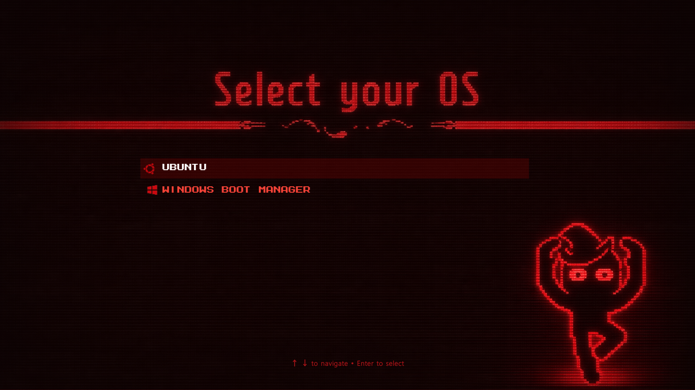

# Inscryption GRUB Theme

A dark, atmospheric GRUB theme inspired by the aesthetics of the game "Inscryption".

 

## Contents

- `theme.txt` — main GRUB theme configuration
- `icons/` — icon set used by the theme (recommended 32×32 PNG)
- `MegamaxJonathanToo-YqOq2.pf2` — bundled bitmap font file
- `FONT LICENSE` — license for the bundled font

## Installation

1. Copy the theme folder to your system themes directory (example path):

```bash
sudo mkdir -p /boot/grub/themes/insc
sudo cp -r . /boot/grub/themes/insc
```

2. Point GRUB to the theme by editing `/etc/default/grub`. Add or update the `GRUB_THEME` line:

```bash
sudo nano /etc/default/grub
```

2.5.Add this line or edit it to (if already there):
```bash
GRUB_THEME="/boot/grub/themes/insc/theme.txt"
```
3. Update GRUB configuration:

- Debian/Ubuntu:
```bash
sudo update-grub
```

- Arch/Fedora and others:
```bash
sudo grub-mkconfig -o /boot/grub/grub.cfg
```

4. Reboot to see the theme in action.
```bash
sudo reboot
```

## What tools I used to make this?


### tools used while making icons and assets:

- Megamax Jonathan Too font: https://www.fontspace.com/megamax-jonathan-too-font-f124011
- Batch crop/resizing: https://batchimagecrop.com/
- General image downloads/processing (used during asset preparation): https://www.iloveimg.com/
- Background removal: https://www.remove.bg/upload
- 32×32 converter: https://resizepanda.com/32x32-image-converter/
- Generated icons image: https://chatgpt.com/


### tools used for designing,drawing and editing the background image:

- Aseprite to draw the character: https://www.aseprite.org/

- Canva to design the overall background : https://www.canva.com/

- Chatgpt to gimmie some desings suggestions and adding the vhs effect on the design made in canva : https://chatgpt.com/


## Contributing

If you want to improve the theme (new icons, tweaks to layout, accessibility fixes), open a pull request or contact me. Provide screenshots and a short changelog for easier review.

---

Thanks for using the Inscryption GRUB theme, enjoy the boot menu.
